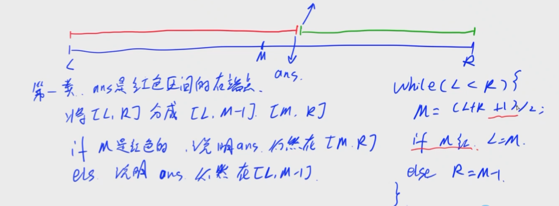

### 排序

#### 快速排序

```c++
void quick_sort(int q[], int l, int r){
    if (l >= r) return;
    // 哨兵取随机位置的元素
    int x = q[rand() % (r - l + 1) + l];
    int i = l - 1, j = r + 1;
    while (i < j){
        do i++; while (q[i] < x);
        do j--; while (q[j] > x);
        if (i < j) swap(q[i], q[j]);
    }
    quick_sort(q, l, j);
    quick_sort(q, j + 1, r);
}
```

其中11、12行可以写成`quick_sort(q, l, i - 1)`和`quick_sort(q, i, r)`,此时哨兵不能取`q[l]`,否则死循环


####  归并排序

```c++
void merge_sort(int q[], int l, int r){
    if (l >= r) return;
	// 分
    int mid = l + r >> 1;
    merge_sort(q, l, mid), merge_sort(q, mid + 1, r);
	// 归并
    int k = 0, i = l, j = mid + 1;
    while (i <= mid && j <= r){
        if (q[i] <= q[j]) tmp[k ++] = q[i ++];
        else tmp[k ++] = q[j ++];
    }
    while (i <= mid) tmp[k ++] = q[i ++];
    while (j <= r) tmp[k ++] = q[j ++];

    for(i = l, j = 0; i <= r; i++, j++) q[i] = tmp[j];
}
```


### 二分

本质是有边界
#### 整数二分

两种边界情况


-   确定一个区间，使得目标值一定在区间中

-   找到一个性质(即**判断条件**)，满足：
    -   性质具有二段性（一半全部满足某一性质，另一半不满足）
    -   答案是二段性的分界点

取端点时，注意是`L=M`还是`R=M`，如果是`L=M`则M取值需要向上取，`M=(L+R+1)>>1`


##### 第一类 左半红色区域右端点

-   ans是红色区域的右端点
-   将`[L, R]`分成`[L, M-1]`和`[M, R]`
-   

```c++
int bsearch(int l, int r){
    // 需要找红色区间右端点
    while(l < r){
        int mid = l + r + 1 >> 1;
        // 符合左半红色区域条件, ans在右端点上
        if(check(mid)) l = mid;
        else r = mid - 1;
    }
} 
```


##### 第二类 右半绿色区域左端点

-   ans是绿色区域的左端点
-   将`[L, R]`分成`[L, M]`和`[M+1, R]`
    -   区分M点分在哪边，主要是看ans端点相对于M的位置

```c++
int bsearch(int l, int r){
    // 需要找绿色区间左端点
    while(l < r){
        int mid = l + r >> 1;
        // 符合右半绿色区域条件, ans在左端点上
        if(check(mid)) r = mid;
        else l = mid + 1;
    }
} 
```


#### 浮点数二分

`(r - l > 1e-8)` 保留六位小数的话，精度就是`1e-8`，总数比要求再多2位即可

两种写法，一种是`while(r - l > *)` 另一种是直接迭代100次


