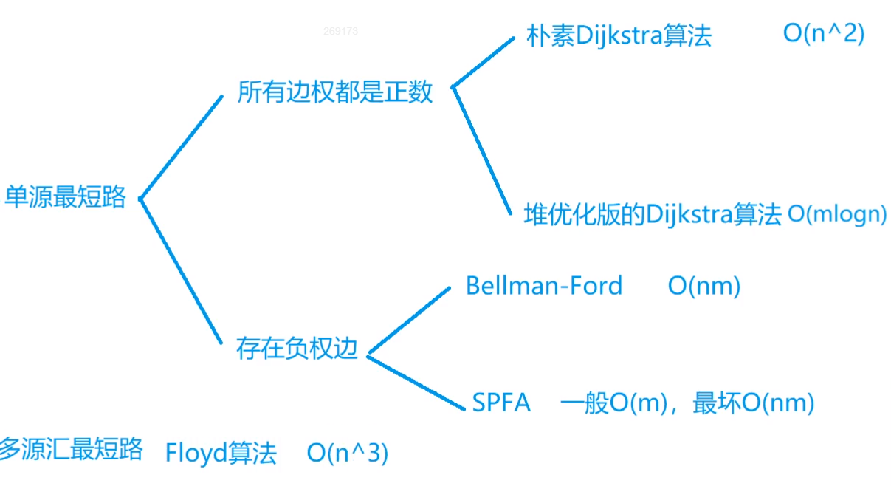
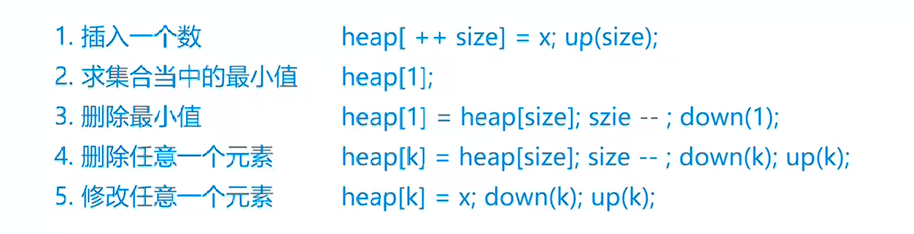
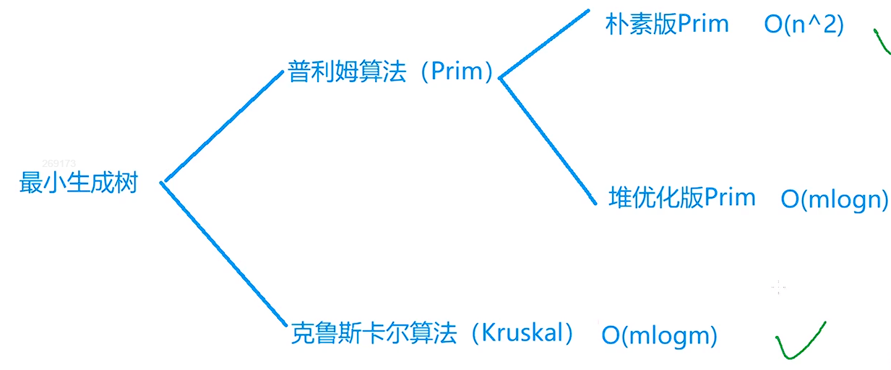
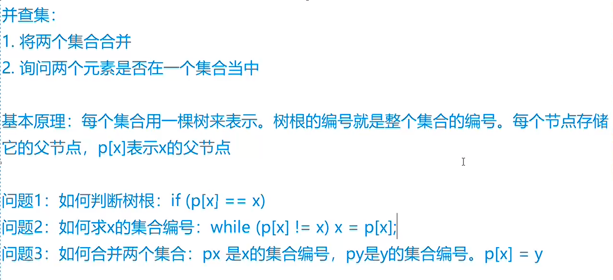
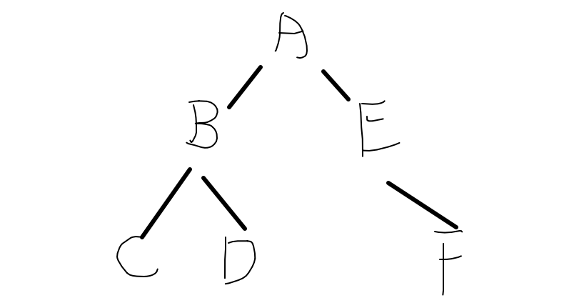

**拓扑序列**

一定是有向无环图

queue <- 所有入度为0的点

while queue 不为空：

​	t <- 队头

​	枚举t的所有出边 t -> j

​	删掉t -> j，d[j]--;

​	if (d[j] == 0) queue <- j

```c++
int q[N], d[N]; //q为入度为0的队列(也是后序的拓扑序列)  h为每一个点的入度

bool topsort(){
    int hh = 0, tt = -1;//头尾指针
    for(int i = 1; i <= n; i++){
        if (!d[i]) q[++tt] = i; //入度为0则入队
    }
    while(hh <= tt){
        int t = q[hh++];
        for(int i = h[t]; i != -1; i = ne[i]){ //遍历所有出边
            int b = e[i];
            d[b]--;
            if (!d[b]) q[++tt] = b;//入度为0则入队
        }
    }
    return tt == n - 1; //所有结点都入过队列则拓扑序列存在
}
```


**最短路问题**



m和n^2同数量级时，稠密图，选朴素Dijkstra

m和n同数量级时，稀疏图，选堆优化版


**Dijkstra**

朴素

1.  dist[1] = 0	dist[i] = +oo
2.  for v in 1 ~ n:
    1.  t <- 不在S中的距离最短的点 	(S：当前已确定最短距离的点)	`可以优化，使用堆找最小`
    2.  S <- t
    3.  用t更新其它点的距离    `优化后总次数变为MlogN`

```c++
int n, m; //点数 边数
int g[N][N]; //存储边权值
int dist[N]; //距离
bool st[N]; //是否已经确认最小距离

int dijkstra(){
    memset(dist, 0x3f, sizeof dist);
    dist[1] = 0;
    
    for(int i = 0; i < n - 1; i++){ // 迭代n-1次
        int t = -1;
        for(int j = 1; j <= n; j++){ //找到相对t最短距离的未确定点
            if (!st[j] && (t == -1 || dist[t] > dist[j]))
                t = j;
        }
        st[t] = true; //加入S确定点集合
        
        for(int j = 1; j <= n; j++){ //更新dist
            dist[j] = min(dist[j], dist[t] + g[t][j]);
        }
    
    }
    
    if(dist[n] == 0x3f3f3f3f) return -1;
    else return dist[n];
}

int main()
{
    scanf("%d%d", &n, &m);

   memset(g, 0x3f, sizeof g); //初始化边权值
    
    while(m--){
        int a, b, c;
        scanf("%d%d%d", &a, &b, &c);
        g[a][b] = min(g[a][b], c); // 保证最小权值
    }

    printf("%d\n", dijkstra());

    return 0;
}

```


堆优化

**数组模拟邻接表**

```c++
// 例有一边A -> B
//h[A]=idx	e[idx]=B	
//ne[idx]=-1	

// h[i] 作为头结点数组，i为结点编号
// e[i] 存储idx为i的某结点指向的结点编号
// ne[i] 存储结点i的下一个结点的下标 / 表示节点i的next指针是多少
// idx 存储当前可用的结点的下标
int h[N], e[N], ne[N], idx, w[N];

//初始化
memset(h, -1, sizeof h);
// 头插法 插入一条有向边 a --> b
void add(int a, int b, int c)
{
    e[idx] = b, ne[idx] = h[a], h[a] = idx++, w[idx] = c;
    //指向结点名	  结点 尾接 头	 结点变为新的头结点
}

//遍历顶点a指向的顶点的值
for(int i = h[a]; i != -1; i = ne[i])
    cout << e[i] << ' ';
```


**堆**



```c++
// 以小根堆为例
void down(int u){
    
    int t = u; //找到当前结点与两个子节点中最小的那个
    if (2 * u <= len && a[t] > a[2 * u]) t = 2 * u;
    if ((2 * u + 1) <= len && a[t] > a[2 * u + 1]) t = 2 * u + 1;
    
    if (t != u){
        swap(a[t], a[u]);//最小数往上，大数下走
        down(t);
    }
    
}
```


堆优化后的Dijsktra	`使用优先队列来替代堆`

```c++
int dijkstra(){
    memset(dist, 0x3f, sizeof dist);
    dist[1] = 0;
    
    priority_queue<PII, vector<PII>, greater<PII>> heap; //优先队列替代堆，使用小根堆
    heap.push({0, 1});
    
    while(heap.size()){
        auto t = heap.top();//取堆顶最小dist结点
        heap.pop();
        
        int ver = t.second, distance = t.first;
        if (st[ver]) continue; //已在S集合中则跳过
        st[ver] = true;
        //遍历邻接表，更新相邻结点的dist
        for(int i = h[ver]; i != -1; i = ne[i]){
            int b = e[i];
            if(dist[b] > dist[ver] + w[i]){
                dist[b] = dist[ver] + w[i];
                heap.push({dist[b], b});//更新后的结点入堆
            }
        }
    }
    if (dist[n] == 0x3f3f3f3f) return -1;
    else return dist[n];
}

int main(){
    scanf("%d%d", &n, &m);
    memset(h, -1, sizeof h); //初始化模拟邻接表   
    while(m--){//读入边
        int a, b, c;
        scanf("%d%d%d", &a, &b, &c);
        add(a, b, c);
    }
    printf("%d\n", dijkstra());
    return 0;
}
```


---

**最小生成树** `一般都是无向图`



一般情况下，稠密图用朴素版Prim

稀疏图用Kruskal


生成树的定义不能有自环

Prim朴素

dist[i] <- +oo

for迭代n次：

1.  t <- 找到**集合S**外距离最近的点，用t更新其他点到**集合S**的距离
2.  st[t] = true;

```c++
#include<iostream>
#include<cstring>
using namespace std;

const int N = 510;

int g[N][N];
int dist[N]; //存储各个结点到生成树的最小距离
bool st[N];

int n, m;

void prim(){
    memset(dist, 0x3f, sizeof dist);
    dist[1] = 0;
    int res = 0;
    for(int i = 0; i < n; i++){
        int t = -1;
        //找到生成树外距离生成树最近的一个点
        for(int j = 1; j <= n; j++){ 
            if (!st[j] && (t == -1 || dist[j] < dist[t]))
                t = j;
        }
        // 出现孤立点
        if (dist[t] == 0x3f3f3f3f){
            printf("impossible");
            return;
        }
        //加入生成树集合
        st[t] = true;
        res += dist[t];
        //通过点t更新生成树外的点到生成树的最短距离
        for(int j = 1; j <= n; j++){ 
            if(!st[j]) dist[j] = min(dist[j], g[t][j]);
        }
        
    }
    printf("%d", res);
    
}

int main(){
    scanf("%d%d", &n, &m);
    memset(g, 0x3f, sizeof g);
    while(m--){
        int a, b, c;
        scanf("%d%d%d", &a, &b, &c);
        
        g[a][b] = g[b][a] = min(g[a][b], c);
    }
    
    prim();
    return 0;
}
```


 

并查集



```c++
int find(int x){ // 路径压缩
    if (p[x] != a) p[x] = find(p[x]);
    return p[x];
}

// 合并
p[find(a)] = find(b);
```

如果要记录集合中点的数量，则每次合并的时候

```c++
size[N]; //集合中点的数量，初始化为1，只有根节点的size有意义
//合并
size[find(b)] += size[find(a)];
p[find(a)] = find(b);// 集合a加入到集合b中 
```


**Kruskal**

1.  将所有边按从小到大排序
2.  枚举每条边a b c
    1.  if ab不连通（并查集）则将这条边加入集合

```c++
struct edge{
    int a, b, w;
    bool operator< (const edge &e) const{
        return w < e.w;
    }
}edges[M];

void kruskal(){
    sort(edges + 1, edges + m + 1);
    
    for(int i = 1; i <= n; i++) p[i] = i;//初始化并查集
    
    for(int i = 1; i <= m; i++){
        
        int a = edges[i].a, b = edges[i].b, w = edges[i].w;
        a = find(a), b = find(b);
        if (a != b){// 不成环
            cnt++;
            res += w;
            p[a] = b;
        }
        
    }
}
```


---

**二分图**


---


由二叉树的前序遍历、中序遍历推出后序遍历序列

例：



前序：(A)(BCD)(EF)

中序：(CBD)(A)(EF)

后序：(CDB)(FE)(A)

由前序的首个结点可找到中序的位置，中序左边为左子树，右边为右子树。

中序中根节点位置的大小可知前序中左子树结点的范围，即可递归。

```c++
void postorder(string preorder, string inorder){
    int len = preorder.length();
    if (!len) return;
    if (len == 1){
        cout << preorder << ' ';
        return;
    }
    int pos = inorder.find(preorder[0]); //找到根节点在中序遍历中的位置
    //pos的大小就是左子树的长度，len-1-pos是右子树的长度
    //后序遍历：左、右、根
    postorder(preorder.substr(1, pos), inorder.substr(0, pos));
    postorder(preorder.substr(1 + pos, len - 1 - pos), 
              inorder.substr(1 + pos, len - 1 - pos));
    cout << preorder[0] << ' ';
}
```

同理，如果知道中序和后序，可推出前序遍历序列

前序：(A)(BCD)(EF)

中序：(CBD)(A)(EF)

后序：(CDB)(FE)(A)

```c++
void preorder(string inorder, string postorder){
    int len = inorder.length();
    if (!len) return;
    if (len == 1){
        cout << inorder << ' ';
        return;
    }
    //前序遍历：根、左、右
    cout << postorder[len - 1] << ' ';
    int pos = inorder.find(postorder[len - 1]); //找到根节点在中序遍历中的位置
    preorder(inorder.substr(0, pos), postorder.substr(0, pos));
    preorder(inorder.substr(pos + 1, len - 1 - pos), postorder.substr(pos, len - 1 - pos));
}
```


